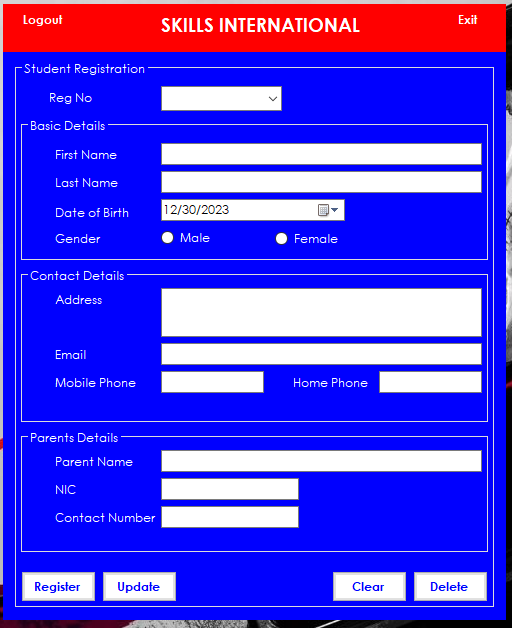
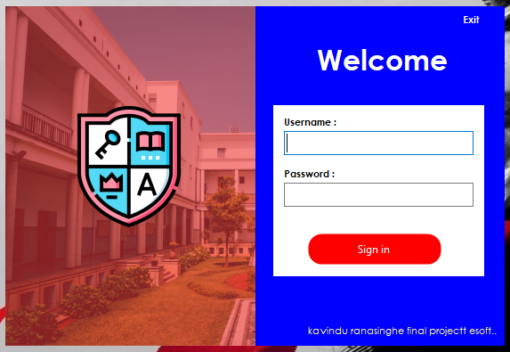
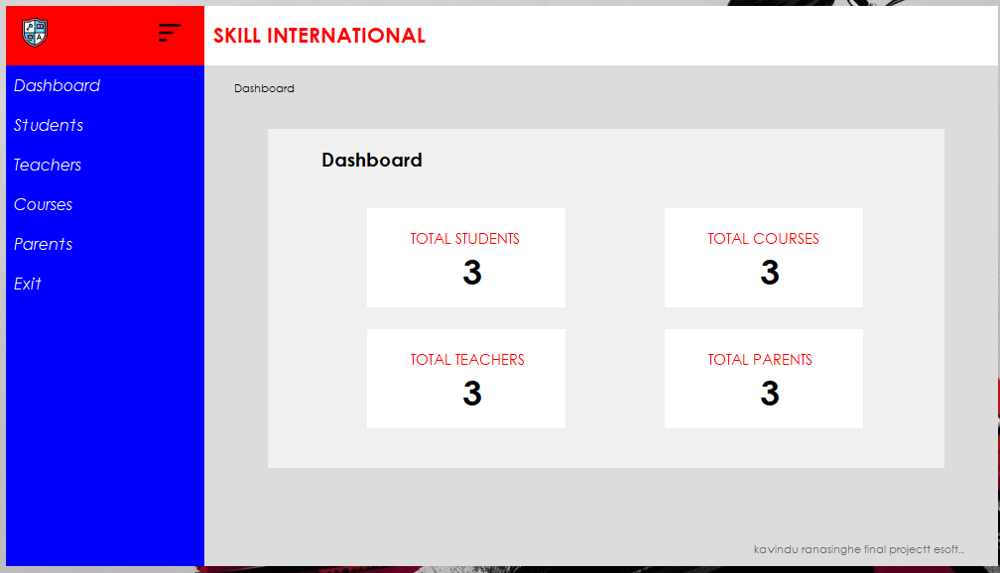
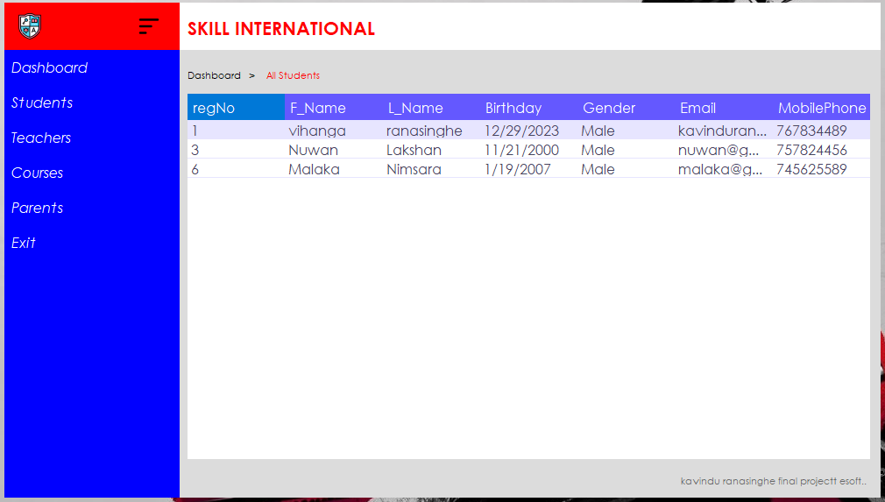
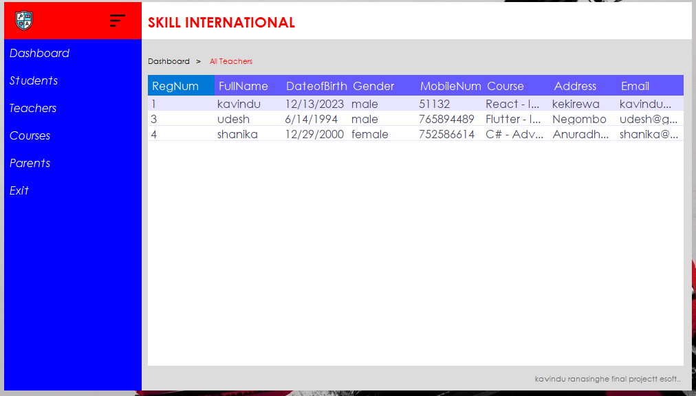
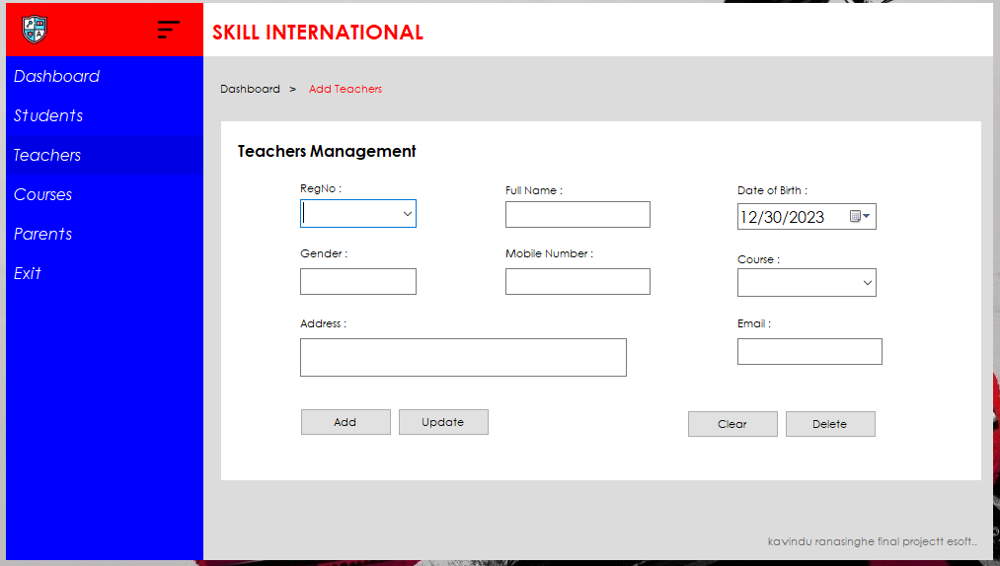
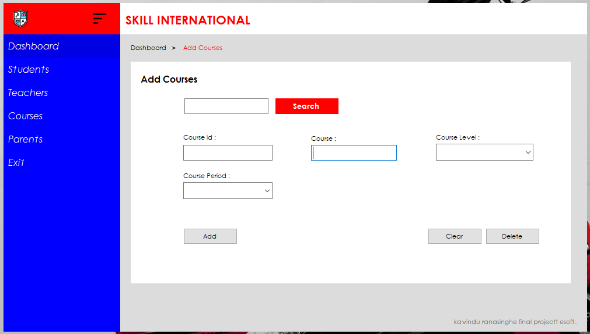
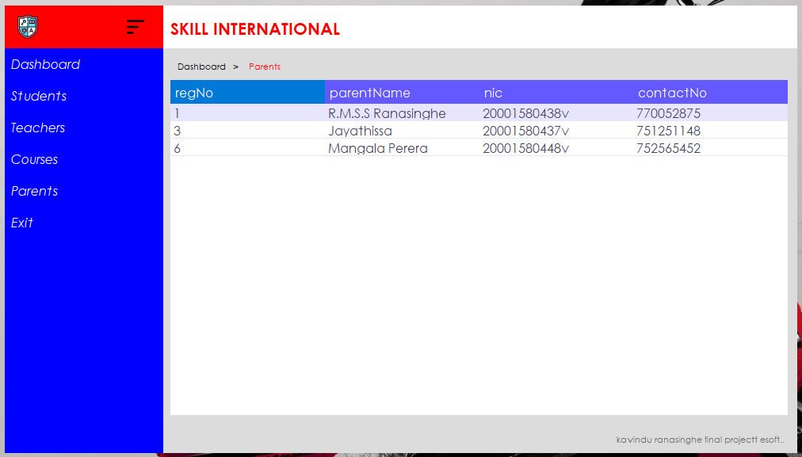

# Student Enrollment System
The Student Enrollment System is a C# application designed to manage the enrollment process of students in an educational institution. This system streamlines the registration process, allowing for efficient management of student information, course details, and enrollment records.

## Technologies Used
- **Programming Language**: C#
- **Framework**: .NET Framework
- **Database**: SQL Server
- **IDE**: Visual Studio

##Screenshots

### Students Registration


### Login


### Dashboard


### All Students


### All Teachers


### Add Teachers


### All Courses


### Add Courses


### Parents


### Steps

1. **Clone the Repository**:
   ```bash
   git clone https://github.com/yourusername/student-enrollment-system.git
   cd student-enrollment-system
